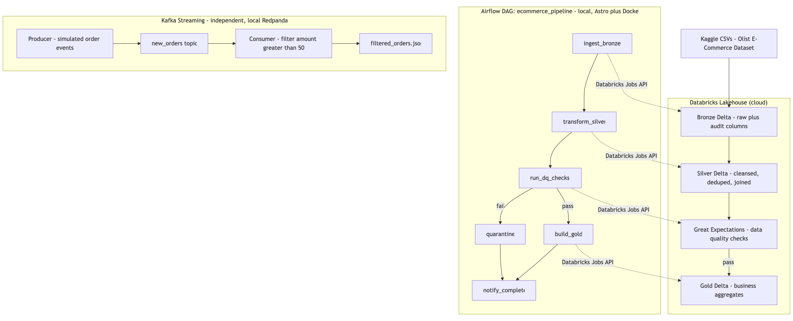
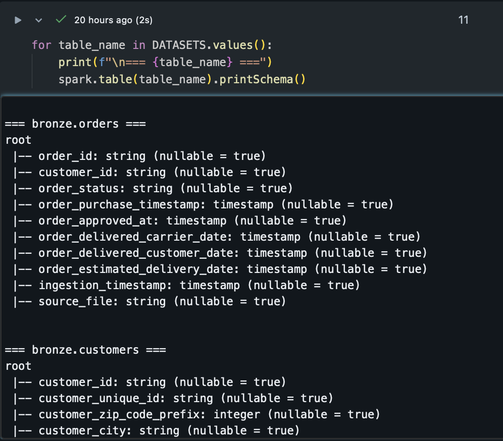
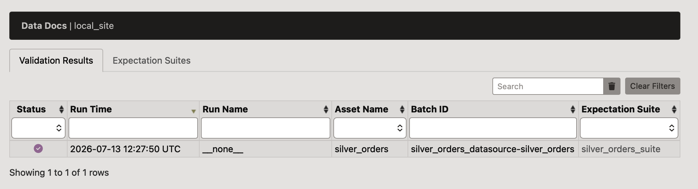
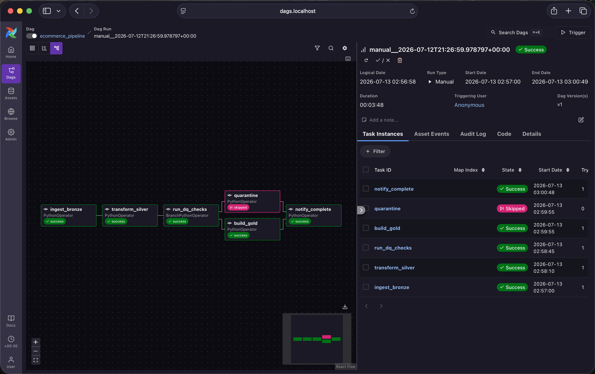

# docs/

Static assets referenced from the root `README.md`: the architecture
diagram and the screenshots of the project.

## What's here

**`architecture.png`** — the overall pipeline: batch path (Bronze →
Silver → Gold, Great Expectations, Airflow) and the independent Kafka
streaming path.

**`bronze_schema.png`** — the Bronze Delta tables' schema after
ingesting all 9 Olist CSVs.

**`gx_data_docs.png`** — Great Expectations' HTML Data Docs for the
Silver orders validation.

**`dag.png`** — a successful run of the `ecommerce_pipeline` Airflow DAG.

